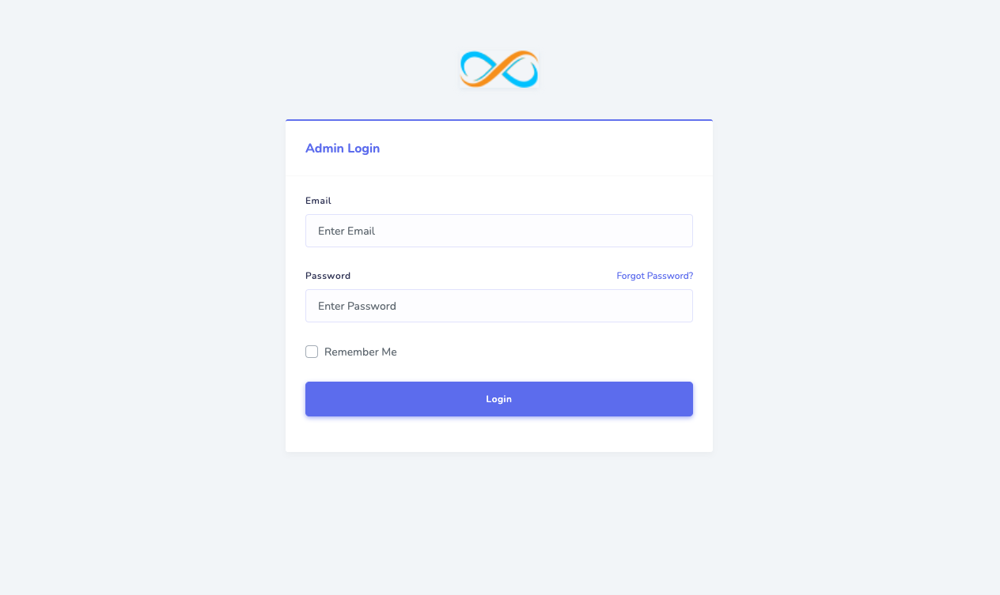
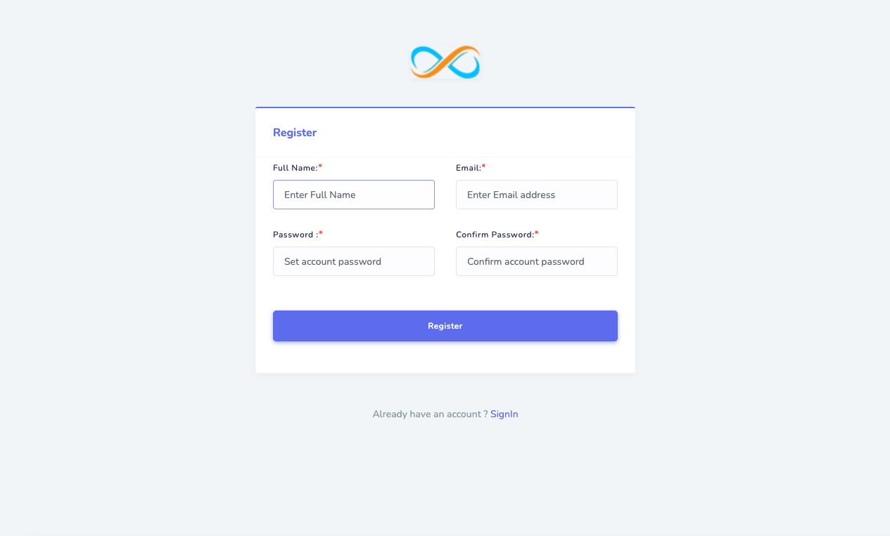
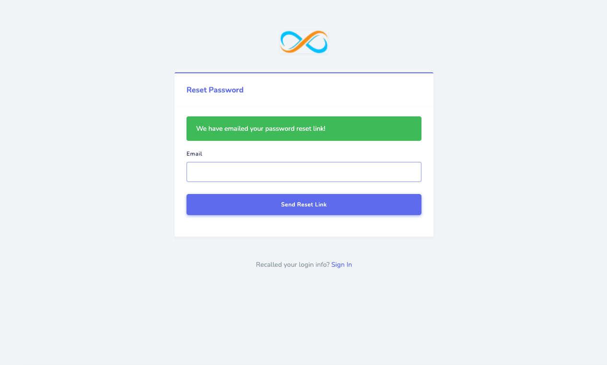
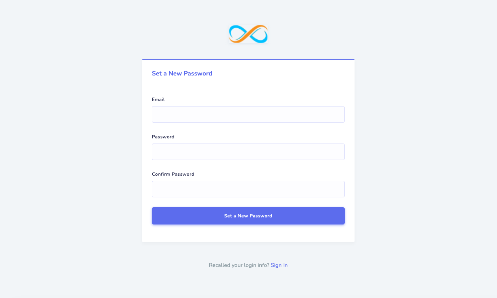
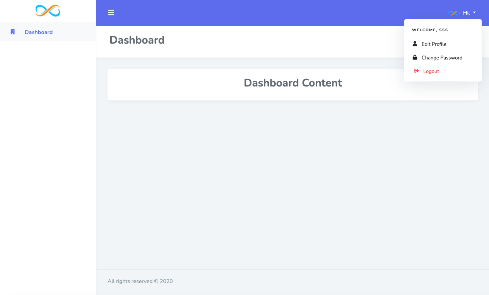
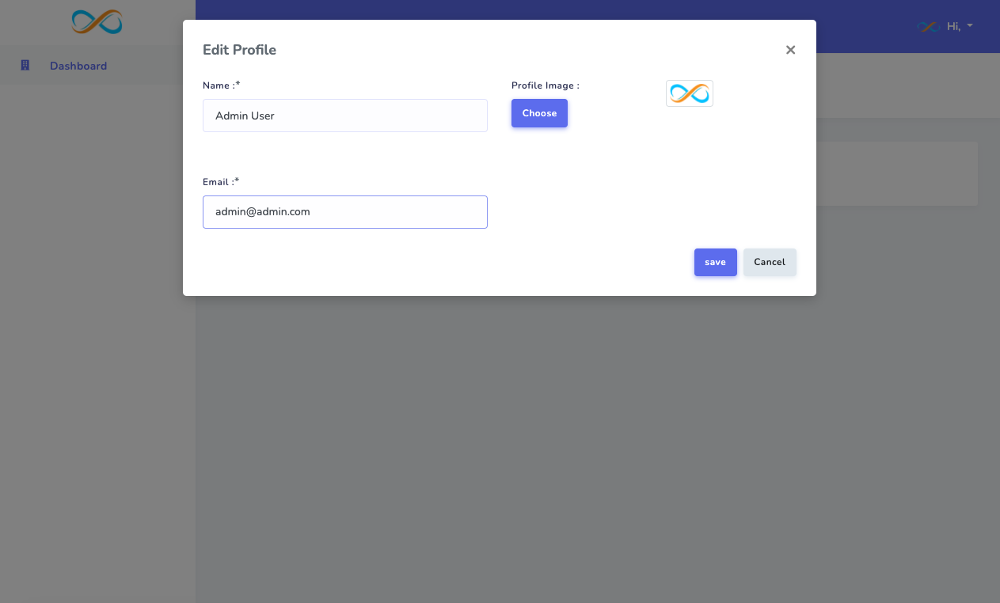

<h1 align="center"></h1>

# Laravel UI Stisla

[Laravel Frontend Scaffolding](https://laravel.com/docs/7.x/frontend) for [Stisla UI](https://demo.getstisla.com/index.html) Theme.

## Installation

Run a command,

`composer require infyomlabs/laravel-ui-stisla`

For Laravel 7,

`composer require infyomlabs/laravel-ui-stisla:^2.0`

For Laravel 6,

`composer require infyomlabs/laravel-ui-stisla:^1.0`

## Usage

Run a command,

To Generate a full authentication UI,

`php artisan ui stisla --auth`

To Install just Stisla theme assets,

`php artisan ui stisla`

And then run,

`npm install && npm run dev`

Or for production,

`npm install && npm run prod`

## Usage with Laravel Fortify (Laravel 8.x only)

This package also provides support for Laravel Fortify for authentication scaffolding.

**NOTE**: Don't forget to install and run Laravel Fortify and perform its required installation steps.

Run a command,

`php artisan ui stisla-fortify --auth`

And then run,

`npm install && npm run dev`

Or for production,

`npm install && npm run prod`

## Support Us

We have created [14+ Laravel packages](https://github.com/InfyOmLabs) which got over 2M+ Downloads so far.
We invested a lot of resources into creating these packages and maintaining them.

You can support us by either sponsoring us or buying one of our paid products. Or help us by spreading the word about us on social platforms via tweets and posts.

### Sponsors

[Become a sponsor](https://opencollective.com/infyomlabs#sponsor) and get your logo on our README on Github with a link to your site.

### Backers

[Become a backer](https://opencollective.com/infyomlabs#backer) and get your image on our README on Github with a link to your site.

### Buy our Paid Products

You can also check out our other paid products on [CodeCanyon](https://codecanyon.net/user/infyomlabs/portfolio).

### Follow Us

- [Twitter](https://twitter.com/infyom)
- [Facebook](https://www.facebook.com/infyom)
- [LinkedIn](https://in.linkedin.com/company/infyom-technologies)
- [Youtube](https://www.youtube.com/channel/UC8IvwfChD6i7Wp4yZp3tNsQ)
- [Contact Us](https://infyom.com/contact-us)

## Made with InfyOm Generator

Also, Do not forget to add your website to [Made with InfyOm Generator List](https://github.com/InfyOmLabs/laravel-generator/blob/develop/made-with-generator.md) list.

## Video Tutorials

Checkout Video Tutorial - **By**: [Shailesh Ladumor](https://github.com/shailesh-ladumor)

|||
|---|---|

## Screenshots

### Login

### Register

### Reset Password Form

### Reset Password

### Admin Layout

### Edit Profile

